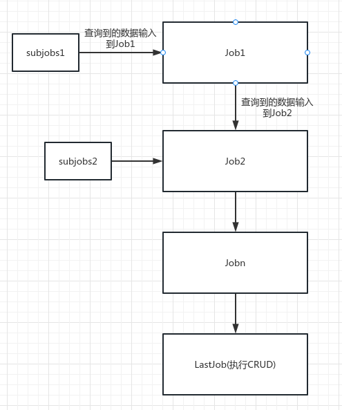

## SQLPipe
一个像管道一样执行多个跨数据库实例查询计划（也支持insert/update/delete）的工具


## 背景
1. 经常有一些跨db查询的需求，比如学生表在实例1,班级表在数据库实例2, 查询起来就非常麻烦

## 下载安装
```shell
go get -u github.com/nicolasq123/sqlpipe
```

## 例子
1. select: 学生表在实例1,班级表在数据库实例2； 需要连表查询整个2年级的所有学生，需要带上班级名称
2. update/delete/insert: 学生表在实例1,班级表在数据库实例2，school在数据库实例3； 需要修改xxx学校的学生数据的相关状态

## 功能
1. 跨数据库实例查询
2. 跨数据库实例update/delete/insert
3. 支持输出到stdout/csv文件

## yaml文件举例

```yaml
dbconfs: 
  "mysql1": "mysql://root:123456@(127.0.0.1)/test1?charset=utf8&sql_mode=TRADITIONAL&parseTime=true" #key为数据库连接的别名
  "mysql2": "mysql://root:123456@(127.0.0.1)/test2?charset=utf8&sql_mode=TRADITIONAL&parseTime=true"
  "mysql3": "mysql://root:123456@(127.0.0.1)/test3?charset=utf8&sql_mode=TRADITIONAL&parseTime=true"

lastjob: &lastjob
  name: lastjob  # 名称
  dbname: mysql1 # 这里与上面对应
  #query: "delete FROM user where class_id ={{.class_id}}"
  query: "select user.id as user_id, user.name as user_name, '{{.class_name}}' as class_name FROM user where class_id ={{.class_id}}" # lastjob才能 select/update/insert/delete
  #next: *

myjob_subjob: &myjob_subjob
  name: myjob_subjob
  dbname: mysql3
  query: "select id as school_id FROM school where name like 'national school%'" # 查询出来的school_id给myjob使用，帮助其跨数据库实例

myjob: &myjob
  name: myjob
  dbname: mysql2
  query: "select id as class_id, name as class_name FROM class where school_id in ({{.school_id}})"
  subjobs: 
    - *myjob_subjob
  next: *lastjob

jobs:
  - *myjob

writertype: both  # 输出到stdout和csv file
```